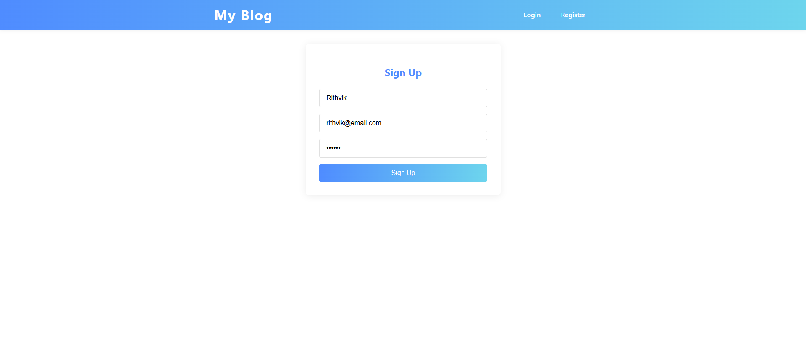
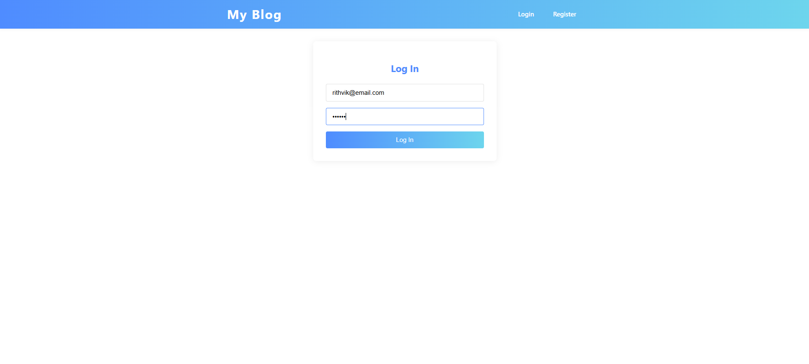
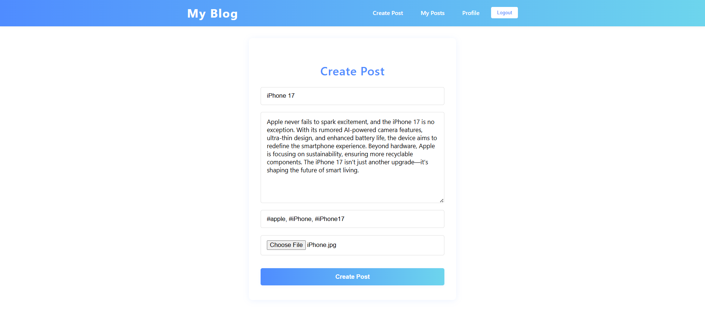
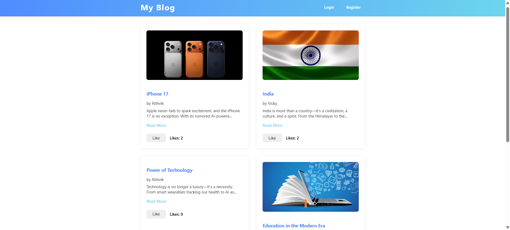
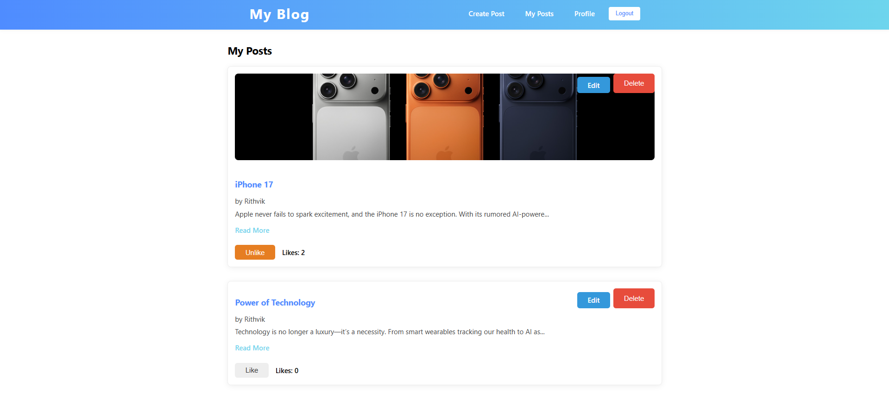
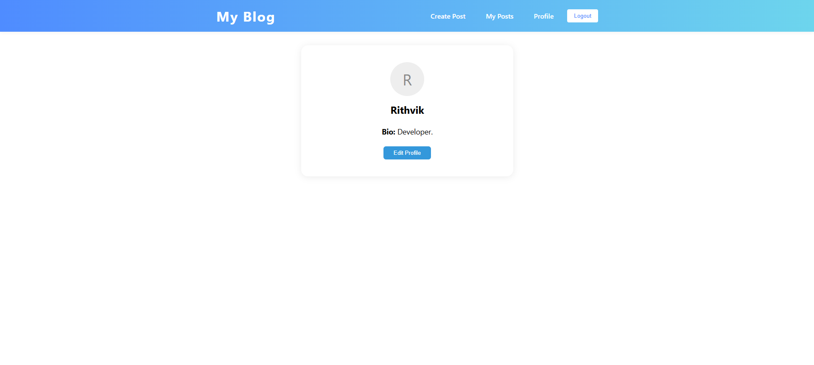

# 📝 Blog Platform

A full-stack **Blog Platform** built with **MERN stack (MongoDB, Express, React, Node.js)** that allows users to register/login, create and manage posts, interact with content, and maintain their own profile.  

---

## 🚀 Features

- 🔐 **Authentication**
  - User **Register/Login**
  - Secure authentication with JWT
  - User profile management

- 📰 **Blog Posts**
  - Create new posts
  - Edit and delete existing posts
  - View individual post details
  - Like and unlike posts

- 👤 **User Profile**
  - View your posts
  - Manage personal information
  - Track liked posts

- ❤️ **Interactivity**
  - Like/unlike functionality
  - See post engagement

---

## 🛠️ Tech Stack

### Frontend
- React.js
- Redux Toolkit (for state management)
- CSS / SCSS

### Backend
- Node.js
- Express.js
- MongoDB (Mongoose ODM)
- JWT Authentication

### Deployment
- Frontend: Netlify / Vercel (or GitHub Pages)
- Backend: Render / Railway / Heroku

---

## 📂 Project Structure
```
blog-platform/
├── backend/
│   ├── controllers/
│   ├── middleware/
│   ├── models/
│   ├── routes/
│   ├── .env
│   ├── package-lock.json
│   ├── package.json
│   └── server.js
├── frontend/
│   ├── public/
│   ├── src/
│   │   ├── assets/
│   │   ├── components/
│   │   ├── pages/
│   │   ├── App.css
│   │   ├── App.jsx
│   │   ├── index.css
│   │   └── main.jsx
│   ├── .eslintrc.cjs
│   ├── index.html
│   ├── package-lock.json
│   ├── package.json
│   └── vite.config.js
└── README.md
```
---

## ⚡ Getting Started

### Prerequisites
- Node.js installed
- MongoDB instance (local or Atlas)

### Installation

1. Clone the repository:
   ```bash
   git clone https://github.com/<your-username>/blog-platform.git
   cd blog-platform
   ```
2. Install backend dependencies:
   ```bash
   cd backend
   npm install
   ```
3. Install frontend dependencies:
   ```bash
   cd ../frontend
   npm install
   ```
4. Create a .env file in the backend with the following:
   ```bash
   MONGO_URI=your_mongodb_connection_string
   JWT_SECRET=your_secret_key
   ```
### Run the Project
- Start backend:
  ```bash
  cd backend
  node server.js
  ```
- Start frontend:
  ```bash
  cd frontend
  npm start
  ```
---
## 📸 Screenshots
- Register and Login:
  
  
- Create Post:
  
- Home:
  
- View Posts (Can edit and delete):
  
- Profile:
  
---
## 🚀 Future Improvements
- Enhanced Authentication:
  - Add Google / GitHub OAuth login
  - Add password reset & email verification
- Comments System:
  - Allow users to comment on posts
  - Nested replies & upvotes for better engagement
- Search & Filters:
  - Full-text search for posts
  - Filter by categories, tags, or author
- Notifications:
  - Real-time notifications for likes, comments, and follows
- Profile Enhancements:
  - pload profile pictures (with cloud storage like AWS S3)
- Mobile App Version 
